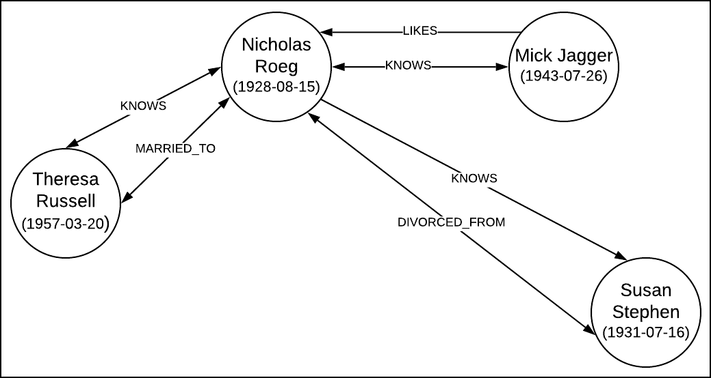

This code repository contains the source code that goes with ProgrammableWeb's 
[Guide to GraphQL: Understanding, Building and Using GraphQL APIs](https://www.programmableweb.com/api-university/guide-to-graphql-understanding-building-and-using-graphql-apis).
The guide is a comprehensive five part series designed to bring API practitioners at any level (beginner,
intermediate, or advanced) up to speed on GraphQL as a technology and how to work with it. The series includes
a hands-on tutorial on working with GraphQL that is accompanied by an easy-to-use interactive learning environment
using the Katacoda platform. There are also eight videos that ProgrammableWeb 
has published on its YouTube channel to go along with that interactive environment. Here are links to the key 
elements (including this repository) of this special package:

* [ProgrammableWeb's 5-Part Series on Getting Started with GraphQL](https://www.programmableweb.com/api-university/guide-to-graphql-understanding-building-and-using-graphql-apis)
* [ProgrammableWeb's Interactive Learning Environment on KataCoda](https://www.katacoda.com/programmableweb/scenarios/understanding-graphql-using-imbob)
* [Playlist of ProgrammableWeb's Companion Videos to go with KataCoda](https://www.youtube.com/playlist?list=PLcgRuP1JhcBPj99Ckn0KDapQmKM9H-T4C)
* [Downloadable source code for the IMBOB GraphQL API and Demonstration App](https://github.com/programmableweb/IMBOB)

# Table of Contents

* **[Installation and Startup](#installation)**
* **[Purpose of Project](#purpose)**
* **[Security and Authentication](#security)**
* **[About the Application Data](#about_data)**
* **[Basic Types](#basic_types)**
* **[Using the @isAdmin Directive](#directives)**
* **[Running IMBOB in a Docker Container](#docker)**
* **[Cheat Sheet](#cheatsheet)**
* **[Opportunities for Improvement](#opportunities)**

<a name="installation"></a>
## Installation and Start Up

To install the dependency libaries:

`npm install`

If you want to install only dependencies required for a production run, type:

`npm install --production`

To start the API server:

`npm start`

or

`node server.js`

To start the sample server-side subscription listener client for the `onEventAdded` event on the channel, `GENERAL_EVENT_CHANNEL`:

`npm run subscriptionListener`

<a name="pupose"></a>
## Purpose of Project
This project is a GraphQL API service that's intended to demonstrate the basic concepts and techniques required to publish an API using Apollo Server.

The scenario illustrated by the project is based on an object graph the contains Movies, Actors, Persons. The graph also describes the connections between Persons.

 

The project code shows readers how to implement a GraphQL schema that includes typedefs, resolvers and subscriptions. The API published by this projects supports [Queries and Mutations](https://graphql.org/learn/queries/). Also, the project supports event messaging by way of a subscription server that gets invoked as part of the overall server startup.

<a name="security"></a>
## Security and Authentication

This projects's sample application supports authenticated access to the API server and Subscription server. The access token is
`ch3ddarch33s3`. Review the tests, [graphql-tests](test/graphql-tests.js) and [graphql-subscription-tests](test/graphql-subscription-tests.js) to
learn the particulars of authenticating to the API and Subscription servers at the code level. When using GraphQL Playground, add the header, `{"authorization": "ch3ddarch33s3"}` to the
 request enable to access.

<a name="about_data"></a>
## About the Application Data

This application uses a set of local  text files to store application data in JSON format. The intention is to make the
application self contained. Thus, all that's required to use and learn from the application is to install and invoke it. Granted,
using text files to store data is not an optimal technique for data storage. But, that the purpose of this application is provide examples for using
GraphQL running under an Apollo Server 2.0, the technique will suffice for now.

<a name="basic_types"></a>
## Basic Types

There are 3 data structures used to create various GraphQL object types. These data structures are
`Movie`, `Person` and `Triple`. As the names imply, `Movie` describes a movie, `Person` describes a person and
`Tripe` describes a connection between two people.

A `Person` and `Actor` are GraphQl types that implements the GrpahQL interface, `Personable`. However, the GraphQL type,
`Actor` has no datastore of its own. A collection of `Actor` objects is attached to the data structure, `Movie`. But, an
`Actor` can be retrieved independent of a `Movie`. Logic internal to the API extracts  `Actor` objects from the `Movie`
objects in the system and presents none, one or many accordingly.

-----

**NOTE :** An `Actor` Must Have a `Person` ID

In order to add an `Actor` to a movie, the base data representing that actor must exist already in the system as a `Person`.
In order for an `Actor` to be added to a `Movie`, you must provide the unique identifier, `id` of
 the corresponding `Person` as it exists in the `Persons` collection of the API. Adding an `Actor` without
 a `Person.id` will throw an error.
 
 -----

<a name="directives"></a>
## Using the @isAdmin Directive

This project publishes a directive, `@isAdmin` that can be used in the mutuation, `ping`.

The directive is provided to demonstrate how to create and use a field directive.

The directive, `@isAdmin` is defined in the file, `./graphql/typedefs.js` like so:

```graphql
directive @isAdmin on FIELD
```

This following code from the file, `./graphql/resolvers.js` is the implementation of the support
for the directive, `@isAdmin` within the `ping` resolver.

```javascript
        ping: async (parent, args, context, info) => {
            const event = await publishEvent('PING', args.messageBody);
            console.log(event);
            let isAdmin = false;
            //check to see if the directive, @isAdmin is in force
            try {
                isAdmin = info.fieldNodes[0].directives[0].name.value === 'isAdmin'
            } catch (e) {
                console.log(`I am gobbling the error ${e}`)
            }
            //if so, add the administrative data and reformat the body
            if(isAdmin){
                const data = event.body;
                const adminData = getRuntimeInfo();
                event.path = JSON.stringify({data, adminData});
            }

            return event;
        }

```

When you apply `@isAdmin` to the
`ping` mutation, the body field returned in the mutation response will contain runtime information about
the server environment in which Apollo Server is running along with the path string submitted in the mutation.

The code below in the GraphQL query language is an example of using the `ping` mutuation with the directive, `@isAdmin`.

```graphql
mutation{
  ping(messageBody: "This is a test Message") @isAdmin {
    createdAt
    body 
    name
    id
  }
}
```

This is the response from the GraphQL API with the added runtime information respresented in the field, `adminData` of
the `body` field. The entire `body` field is expressed as `string`. Use
`JSON.parse()` to convert the value of the `body` field to a JSON object.

```JSON
{
  "data": {
    "ping": {
      "createdAt": "Tue Apr 02 2019 20:39:38 GMT-0700 (PDT)",
      "body ": "{\"data\":\"This is a test message\",\"adminData\":{\"processId\":43414,\"memoryUsage\":{\"rss\":48549888,\"heapTotal\":21921792,\"heapUsed\":19254104,\"external\":128408},\"networkInfo\":{\"lo0\":[{\"address\":\"127.0.0.1\",\"netmask\":\"255.0.0.0\",\"family\":\"IPv4\",\"mac\":\"00:00:00:00:00:00\",\"internal\":true,\"cidr\":\"127.0.0.1/8\"},{\"address\":\"::1\",\"netmask\":\"ffff:ffff:ffff:ffff:ffff:ffff:ffff:ffff\",\"family\":\"IPv6\",\"mac\":\"00:00:00:00:00:00\",\"scopeid\":0,\"internal\":true,\"cidr\":\"::1/128\"},{\"address\":\"fe80::1\",\"netmask\":\"ffff:ffff:ffff:ffff::\",\"family\":\"IPv6\",\"mac\":\"00:00:00:00:00:00\",\"scopeid\":1,\"internal\":true,\"cidr\":\"fe80::1/64\"}],\"en5\":[{\"address\":\"fe80::1c85:bcf4:272d:8c72\",\"netmask\":\"ffff:ffff:ffff:ffff::\",\"family\":\"IPv6\",\"mac\":\"00:e0:4c:68:02:9f\",\"scopeid\":5,\"internal\":false,\"cidr\":\"fe80::1c85:bcf4:272d:8c72/64\"},{\"address\":\"192.168.86.130\",\"netmask\":\"255.255.255.0\",\"family\":\"IPv4\",\"mac\":\"00:e0:4c:68:02:9f\",\"internal\":false,\"cidr\":\"192.168.86.130/24\"}],\"utun0\":[{\"address\":\"fe80::567b:55a0:aef1:9877\",\"netmask\":\"ffff:ffff:ffff:ffff::\",\"family\":\"IPv6\",\"mac\":\"00:00:00:00:00:00\",\"scopeid\":12,\"internal\":false,\"cidr\":\"fe80::567b:55a0:aef1:9877/64\"}]},\"currentTime\":\"2019-04-03T03:39:38.079Z\"}}",
      "name": "PING",
      "id": "bd7bd5c9-ab23-4e30-a808-05a08e055ec2"
    }
  }
}

```
<a name="docker"></a>
## Running IMBOB in a Docker Container

The `Dockerfile` that defines the container image for IMBOB is at the root of this project.

First we need to build the container image for IMBOB. Assuming that you have
Docker installed on your system, navigate to this project's root and in your file system and type:

`docker build -t imbob .`

Next, we need to create and run a container based on the container image we've just built. At the command line, type:

`docker run -d -p 4000:4000 imbob`

<a name="cheatsheet"></a>
## Cheat Sheet

The following queries and mutations are examples that can be executed against this project's API using GraphQL Playgound.

Don't forget to add the authentication token. `{"authentication": "ch3ddarch33se"}` the headers section of GraphQL Playground when running the particular query.

### Introspection

Introspection of the API
```graphql
{  __schema {
    types {
      name
      fields {
        name
      }
    }
  }
}
```

### Subscriptions and events

Registering and listening to subscription at `http://localhost:4000/graphql`

```graphql
subscription onEventAdded{
  onEventAdded{
    id
    name
    body
    createdAt
    storedAt
  }
}
```

The following mutation executed at `http://localhost:4000/` that will create a message that can be intercepted by clients listening at the registered subscription, `onEventAdded`.

The mutation, `ping` is a utility mutation that publishes an `Event` message the can be consumed by subscribing to the 
subscription, `onEventAdded`
```graphql
mutation{
  ping(messageBody: "Hi There"){
    createdAt
    body
    name
    id
  }
}
```

The mutation's response
```json
{
  "data": {
    "ping": {
      "createdAt": "Wed Feb 13 2019 19:54:00 GMT-0800 (Pacific Standard Time)",
      "body": "Hi There",
      "name": "PING",
      "id": "0316cd51-abcc-4e1a-94a7-e81a1e0010d6"
    }
  }
}
```

The event generated by the subscription and available to listening clients
```json
{
  "data": {
    "onEventAdded": {
      "id": "0316cd51-abcc-4e1a-94a7-e81a1e0010d6",
      "name": "PING",
      "body": "Hi There",
      "createdAt": "Wed Feb 13 2019 19:54:00 GMT-0800 (Pacific Standard Time)",
      "storedAt": "Wed Feb 13 2019 19:54:00 GMT-0800 (Pacific Standard Time)"
    }
  }
}
```
### Simple Mutation: Adding a Person

```graphql
mutation{
  addPerson(person: {firstName: "A_FIRST_NAME", lastName: "A_LAST_NAME", dob: "YYYY-MM_DD"}){
    id
    firstName
    lastName
    dob
  }
}
```
### Advanced Mutation: Adding a Movie Using a Query Variable

The query variable definition:

```JSON
{"movie":{
  "title": "Bad Timing",
  "releaseDate": "1980-10-25",
  "directors": [{
      "id": "e068a318-24bc-43c4-a1dd-e73394da6fd2",
      "firstName": "Nicholas",
      "lastName": "Roeg",
      "dob": "1928-08-15"
  }],
  "actors": [{
    "id": "b91d3cea-4013-42a3-b869-b1c8bfcc1c95",
    "firstName": "Theresa",
    "lastName": "Russell",
    "dob": "1957-03-20",
    "role": "Milena Flaherty"
  }
  ]
}}
```
The mutation

```graphql
mutation($movie: MovieInput!){
  addMovie(movie:$movie ){
    id
    title
    releaseDate
    directors{
      id
      firstName
      lastName
    }
    actors{
      id
      firstName
      lastName
    }
  }
}
```
The result
```JSON
{
  "data": {
    "addMovie": {
      "id": "6959112a-2f90-48e5-814a-26d7c3c15e57",
      "title": "Bad Timing",
      "releaseDate": "1980-10-25T00:00:00.000Z",
      "directors": [
        {
          "id": "e068a318-24bc-43c4-a1dd-e73394da6fd2",
          "firstName": "Nicholas",
          "lastName": "Roeg"
        }
      ],
      "actors": [
        {
          "id": "b91d3cea-4013-42a3-b869-b1c8bfcc1c95",
          "firstName": "Theresa",
          "lastName": "Russell",
        }
      ]
    }
  }
}
```

### Queries with Pagination

Paginated `Person`:
```graphql

{
  person(id:"fee6bad2-7fd2-4bf6-beab-82603062a1ab"){
    firstName
    lastName
    likesConnection(paginationSpec:{first:5}){
      pageInfo{
        endCursor
        hasNextPage
      }
      edges{
        node{
          firstName
          lastName
        }
      }
    }
  }
}
```
Paginated `LikesConnection` on `Persons`
```graphql

{
 persons {
  firstName
  lastName
  likesConnection(paginationSpec:{first:5}){
    pageInfo{
      hasNextPage
      endCursor
    }
    edges{
      node{
        firstName
        lastName
      }
    }
  }
 }
}
```

<a name="opportunities"></a>
## Opportunities for Improvement

- Implement data and query caching
- Implement validation of the following:
    - `movie`, adding and updating to make sure all is well and no replications
    - `person`, adding and updating to make sure all is well and no replications
    - `triple`, adding and updating to make sure all is well and no replications
